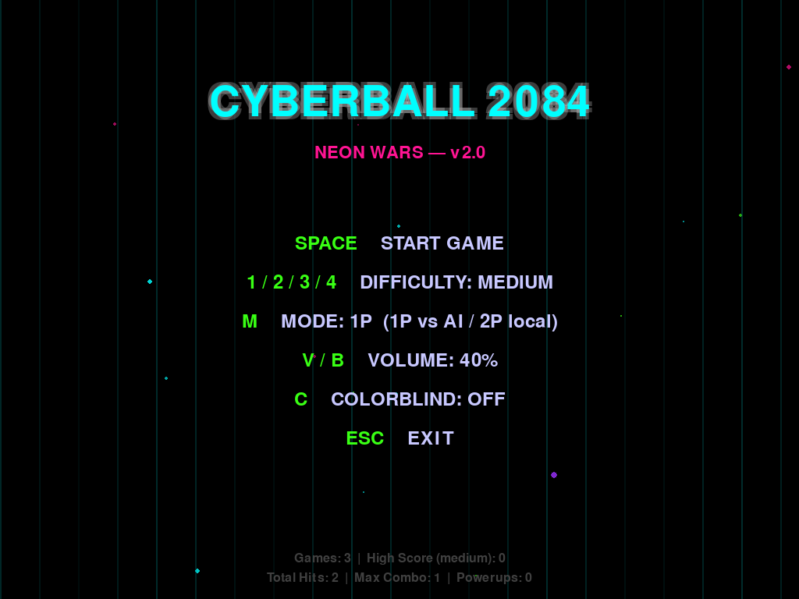
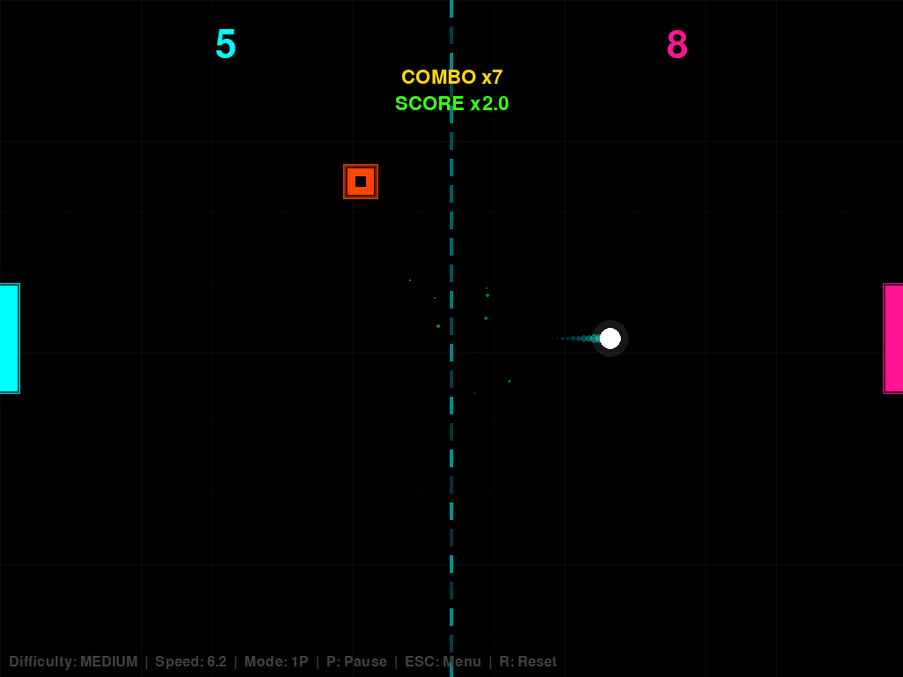
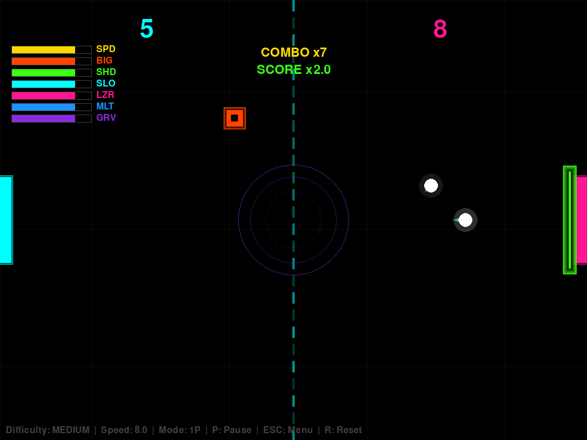
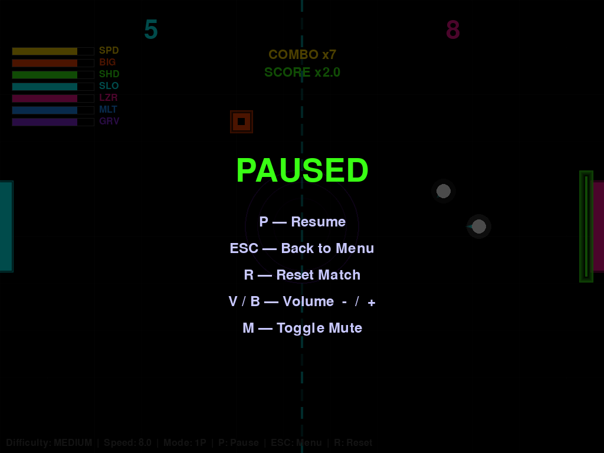

# Cyberball_2084

## The Tale of Two AIs and THREE Years 🤖⚡

This project started as a simple experiment: "How well could ChatGPT create a basic game?" 

Fast forward THREE YEARS later... Claude Code decided to crash the party TWICE and said: *"You thought the first upgrade was wild? Hold my quantum processor ⚡, I'll make it EVEN MORE INSANE!"*

What began as a humble Pong clone with ChatGPT has now evolved into a full-blown neon-soaked, particle-exploding, screen-shaking, combo-counting, SHIELD-WIELDING, GRAVITY-BENDING, TIME-WARPING CYBERBALL EXPERIENCE! 

**ChatGPT (2023):** "Here's a simple paddle game with basic physics..."  
**Claude (2025 v1):** "Here's your paddle game with EXTREME AI, power-ups, and cyberpunk aesthetics!"  
**Claude (2025 v2):** "THAT WASN'T ENOUGH! Here's 7 POWER-UPS, COMBO MULTIPLIERS, LASER WEAPONS, AND GRAVITY WELLS! 🚀" 

## 🆕 What's New in v4 (BOSS BATTLES + UI/UX OVERHAUL)

### 👹 3-Boss Rotation
Every **5 player points**, the AI paddle is replaced by a boss. Defeat it to advance; lose a point and the same boss returns next round.

| Boss | HP | Size | Ability |
|------|----|----|---------|
| **Titan** | 5 | 2.5× tall | Slow tank |
| **Barrage** | 3 | Normal | Fires 2 projectiles every 2s |
| **Split** | 2+2 | Two half-height paddles | Independent HP each |

**Boss defeat reward:** score bonus + random powerup auto-activated for 3 seconds. Stats track kills per boss type.

### 🖥️ UI/UX Upgrades
- **Main menu**: animated auto-rally demo background + `O` key opens the Settings screen
- **Settings screen**: adjust volume, colorblind palette, 1P/2P mode, slow-mo FX, shake intensity (persisted)
- **Game over screen**: first to 11 points wins; match summary card with combo, boss kills, powerups, play time
- **Screen effects**: score flash, slow-mo, boss-incoming banner, red vignette during boss fights
- **Boss HP bar**: top-center during encounters

### 🔧 Architecture
- New modules: `entities/boss.py`, `systems/boss_manager.py`, `ui/effects.ScreenEffect`, `ui/gameover.py`, `ui/settings.py`, `ui/typography.py`, `ui/backgrounds.py`
- Save schema extended with `boss_kills` and `settings` (backward compatible)
- Test suite grew to 44 tests

---

## 🎮 What's New in v2 (ULTRA ENHANCED!)

### 🌟 NEW POWER-UPS (7 TOTAL!)
- 🛡️ **Shield Barriers** - Energy shields that deflect balls without paddle contact
- 🌀 **Gravity Wells** - Create gravitational fields that bend ball trajectories
- ⏰ **Time Slow** - Manipulate time itself for tactical advantage
- 🔫 **Laser Weapons** - Fire energy beams with SPACE to deflect balls
- ⚡ **Speed Boost** - Ball acceleration (enhanced from v1)
- 📏 **Paddle Size** - Giant paddles for easier defense
- 🎱 **Multi-Ball** - Spawn additional balls for chaos

### 🔥 COMBO SYSTEM & SCORE MULTIPLIERS
- Build consecutive hit combos for massive score bonuses
- **3+ hits**: 1.5x score multiplier
- **5+ hits**: 2.0x score multiplier  
- **10+ hits**: 3.0x TRIPLE SCORE!
- Visual feedback with golden particle explosions

### 🛠️ CRITICAL BUG FIXES
- Fixed type confusion with ball instances
- Added zero-division protection in AI prediction
- Fixed paddle position restoration 
- Implemented particle limit system (max 500)

### 💥 ENHANCED EVERYTHING
- **Visual Effects** - Glowing shields, gravity distortions, laser beams!
- **Strategic Depth** - Combine power-ups for tactical gameplay
- **Improved AI** - Smarter prediction with adaptive strategies
- **Better Physics** - Gravity manipulation and time dilation effects

The blue paddle still moves (but now it can SHOOT LASERS), and you still control the right paddle, but now it's an INTERDIMENSIONAL BATTLE WITH TIME-BENDING WEAPONS!

### Previous Versions

This is 2023 ChatGPT


This is 2025 Claude v1


This is 2025 Claude v2


# Installation

1. Clone the repository
2. Install pygame (if you don't have it already)
```bash
pip install pygame
```
3. Run the game and prepare for CYBERPUNK OVERLOAD
```bash
python main.py
```

## Controls

**Menu:**
- `SPACE` - Start the digital mayhem
- `1/2/3/4` - Choose your doom difficulty (Easy/Medium/Hard/EXTREME)
- `ESC` - Retreat to safety

**In-Game:**
- `UP/DOWN` - Player 1 paddle (right)
- `W/S` - Player 2 paddle (left, in 2P mode)
- `F` - Fire laser weapon (when laser power-up active) 🔫
- `P` - Pause / Resume
- `R` - Reset match
- `V/B` - Volume −/+
- `M` - Toggle mute
- `ESC` - Back to menu

**Menu extras:**
- `M` - Toggle 1P (vs AI) / 2P (local WASD) mode
- `C` - Colorblind palette toggle

## Game Features

🎮 **Four Difficulty Levels:**
- **Easy:** AI is sleepy, you might win
- **Medium:** AI is awake, good luck
- **Hard:** AI predicts the future
- **EXTREME:** AI has achieved sentience and questions your life choices

🎯 **7 Unique Power-ups:**
- **Shield (Green)** - Energy barriers that auto-deflect balls
- **Gravity Well (Purple)** - Bend spacetime to control ball trajectories  
- **Time Slow (Cyan)** - Matrix-style bullet time
- **Laser (Pink)** - Pew pew! Shoot to deflect
- **Speed (Gold)** - Accelerate ball velocity
- **Size (Red)** - Mega paddle mode
- **Multi-Ball (Blue)** - Triple the chaos

🎊 **Advanced Combo System:**
- Chain hits for score multipliers (1.5x, 2x, 3x!)
- Golden particle explosions show your combo power
- Lose combo if you miss for 2 seconds

📈 **Enhanced Statistics:**
- Track games played, total hits, max combo
- High scores for each difficulty
- Power-ups collected counter  

## The AI Evolution Story

**2023 ChatGPT Version:** Simple, clean, basic Pong  
**2025 Claude v1:** "What if we made it CYBERPUNK and ADDED EVERYTHING?"  
**2025 Claude v2:** "EVERYTHING WASN'T ENOUGH! ADD SHIELDS, LASERS, GRAVITY MANIPULATION, AND TIME CONTROL!"

## 🏗️ v3 Architecture (Modular Rewrite)

```
cyberball/
├── config.py              # Constants, palette, save path
├── game.py                # GameState + main loop
├── entities/              # Ball · Paddle · PowerUp · GravityWell · Laser · Particle
├── systems/               # audio (PCM sine tones) · stats (JSON persist) · ai (predictive)
└── ui/                    # menu · hud · effects (glow)
tests/                     # 12 tests: unit + headless smoke
```

**Run tests:**
```bash
SDL_VIDEODRIVER=dummy SDL_AUDIODRIVER=dummy python -m unittest discover tests
```

**v3 improvements:** modular package · `GameState` encapsulation (no globals) · predictive AI with wall-bounce folding · persistent high scores (`~/.cyberball2084/save.json`) · live powerup timer bars · 2P local mode · volume control · proper PCM audio · paddle tunneling fix · 12-test suite.

## TODO 

- [x] ~~Add RL feature~~ 
- [x] Make it EXTREMELY cyberpunk ✨
- [x] Add enough visual effects to require sunglasses 🕶️
- [x] Make the AI terrifyingly good 🤖
- [x] Add shield barriers and defensive systems 🛡️
- [x] Implement gravity manipulation 🌀
- [x] Add time control mechanics ⏰
- [x] Create laser weapon system 🔫
- [x] Build combo multiplier system 🎯
- [x] Modularize into package + unit tests 🧱
- [x] Persistent high scores 💾
- [x] 2P local mode (WASD) 🎮
- [ ] Add boss battles every 5 levels
- [ ] Create achievement system
- [ ] Add VR support (because why not)
- [ ] Integrate with smart fridge (for maximum cyberpunk)

## Credits

**Original Concept:** ChatGPT (2023) - Created a humble Pong game  
**Cyberpunk Evolution v1:** Claude Code (2025) - "I turned your Pong into CYBERBALL 2084!"  
**ULTRA Enhancement v2:** Claude Code (2025) - "Now with SHIELDS, LASERS, and TIME MANIPULATION!"  
**Human Supervision:** gyupro89 - "Just wanted a simple game... got an interdimensional warfare simulator instead"

## Original GPT Prompt

https://chat.openai.com/share/85b4e920-87ea-4266-856f-bc29edd0af86

*"It was simpler times back then..." - A nostalgic human, 2025*

This is 2026-04-14 Claude




